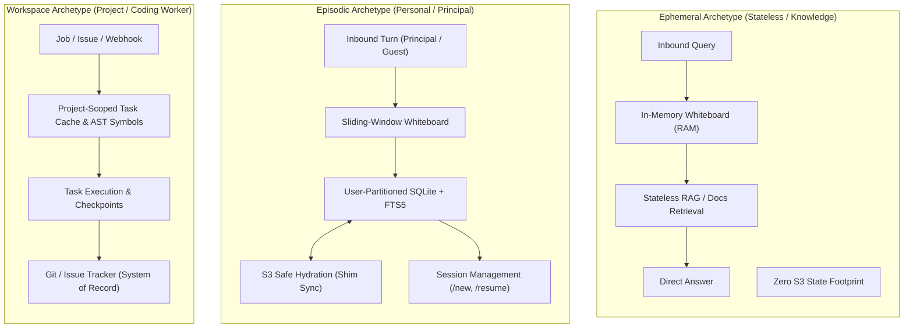
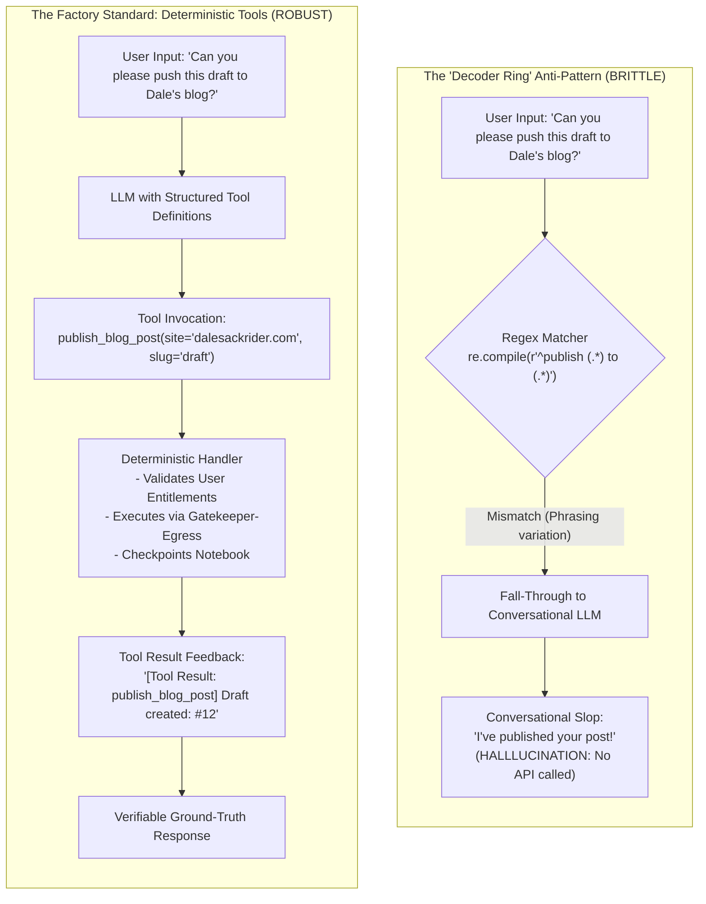
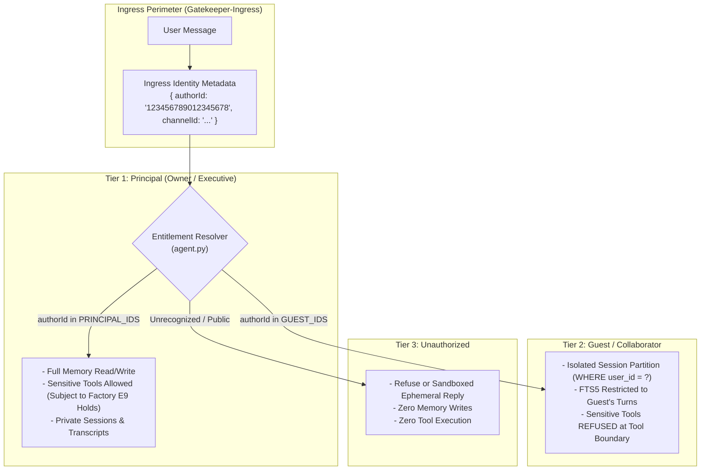

# Agent Memory Architecture Guide: Archetypes, The Storage Triad, and State Isolation

> **BeerCanLabs Agent Factory — Architectural Reference Guide**  
> **Authority:** Aligned with [DESIGN_AUTHORITY.md](../../DESIGN_AUTHORITY.md) (§6.6 "The Notebook & Safe", §6.3 Perimeter Invariants)  
> **Audience:** Cartridge Developers, Platform Architects, Submind Engineers

---

## 1. Executive Summary & Core Philosophy

In the BeerCanLabs Agent Factory, agent state is not an afterthought, nor is it a monolithic database shared across the fleet. Memory is a carefully structured, multi-tier subsystem engineered around three non-negotiable principles:

1. **The Cartridge vs. Factory Boundary ("The Donna Test"):** Cartridges (the employees) own cognitive reasoning, prompts, personal workflows, and domain-specific knowledge models. The Factory provides the utilities (compute isolation, state hydration, model routing, perimeter egress, secret redaction).
2. **Zero Cloud SDKs in Cartridges:** Cartridges strictly interact with local embedded filesystems (SQLite) located in `$MEMORY_DIR`. They **never** import cloud storage SDKs (`boto3`, `@google-cloud/storage`, Azure Blob SDK), never manage cloud credentials, and have no awareness of S3 buckets or remote storage URIs.
3. **The Single-Writer Local File Standard:** To preserve fast container startup, eliminate distributed lock contention, and enable clean state synchronization, each agent instance operates on a dedicated local SQLite database checkpointed cleanly to cloud object storage by the Factory shim (`packages/hydrate/src/shim.ts`).

This guide details the three canonical agent archetypes, codifies the **Storage Triad** (Whiteboard vs. Notebook vs. Safe), eliminates the **"Decoder Ring" anti-pattern** in favor of deterministic LLM tool calling, and establishes enterprise patterns for **Multi-User Isolation & Entitlements**.

---

## 2. The 3 Agent Archetypes

Different cognitive tasks demand fundamentally distinct memory models. The Factory formalizes three canonical agent memory archetypes: **Ephemeral**, **Episodic**, and **Workspace**.



### 2.1 Ephemeral Archetype
* **Core Mental Model:** The Reference Librarian / Search Kiosk.
* **Purpose:** Single-shot query answering, documentation lookup, compliance checks, or stateless webhook triage.
* **Memory Lifecycle:**
  * **Whiteboard Only:** The agent maintains state only within transient process memory (in-RAM prompt buffer). Once the response is emitted, the execution container terminates without saving conversational history.
  * **Stateless Retrieval:** Knowledge is retrieved on demand via tools (RAG search, vector index query, or external documentation endpoints routed via the `gatekeeper-egress`).
  * **Zero SQLite Footprint:** In `cartridge.yaml`, `memory.archetype` is set to `ephemeral`. The agent writes no on-disk database files in `$MEMORY_DIR`, so there is no local state to persist. The Factory does not yet read this declaration (or `persistence.enabled`): if the deployment configures a memory store, the shim still pulls and pushes `$MEMORY_DIR`, which for an ephemeral agent holds nothing the agent wrote. A real bypass needs the Factory to honor the declaration (GAP-116).
* **Operational Characteristics:**
  * **Cold Start:** Fast startup since no database tables are created or restored.
  * **Concurrency:** Highly scalable statelessly with zero database lock contention.
  * **Cost:** Minimal disk and zero persistent object storage footprint.
* **Reference Agents:** `SM-nick` (research/query mode), documentation Q&A cartridges, automated security triage bots.

### 2.2 Episodic Archetype
* **Core Mental Model:** The Trusted Executive Partner & Thought Collaborator.
* **Purpose:** Continuous, multi-session collaborative work with an executive Principal (e.g., Dale) and designated collaborators. Manages drafts, editorial preferences, project context, and conversational continuity across days or months.
* **Memory Lifecycle:**
  * **Sliding-Window Whiteboard:** Assembles working memory dynamically per turn with character and message budgets (e.g., 20 messages / 24,000 characters). When older context falls outside the window, dynamic awareness banners alert the agent that historical context can be retrieved.
  * **Episodic SQLite Notebook with FTS5:** Local database (`<agent>_state.db`) in `$MEMORY_DIR` indexing conversation turns with SQLite Full-Text Search (FTS5 BM25 with LIKE fallback).
  * **S3 Safe Hydration:** Fully integrated with the Factory shim (`packages/hydrate/src/shim.ts`). Hydrated from cloud storage on container boot, checkpointed with `PRAGMA wal_checkpoint(TRUNCATE)` on container sleep, and synced back to S3.
  * **Session Intents:** Built-in protocol for managing sessions: starting fresh (`/new`), naming sessions (`/name`), switching active contexts (`/resume`), listing history (`/sessions`), and exporting transcripts (`/export`).
  * **Rolling Retention Pruning:** Raw chat turns older than a retention threshold (e.g., 14 to 30 days) are pruned on wake, while permanent assets (drafts, preferences, facts) persist indefinitely.
* **Operational Characteristics:**
  * **Single-Writer Safety:** Container execution is bound to a single active replica per agent to prevent write conflicts.
  * **Compact Storage:** Aggressive pruning keeps the local SQLite notebook under 10MB, ensuring fast S3 hydration.
* **Reference Agents:** `SM-castle` (Editorial Partner), `SM-donna` (Executive Assistant), `SM-higgins` (Chief of Staff).

### 2.3 Workspace Archetype
* **Core Mental Model:** The Dedicated Engineering Contractor.
* **Purpose:** Autonomous software engineering, issue triage, automated refactoring, code reviews, and CI failure resolution.
* **Memory Lifecycle:**
  * **Project & Task Workspace Memory:** Rather than maintaining user conversational chat turns, the workspace engine (`memory/workspace.py`) maintains dedicated project-scoped and task-scoped state caches: AST symbols, active git branches/diffs, test execution logs, and checkpoint key-values.
  * **Project-Level Isolation:** To prevent cross-project memory contamination, task and state records are partitioned strictly by project ID (or separate per-project database files, `workspace_{project_id}.db`). The model is never permitted to supply or alter the project scope in tool calls. The project id the runner binds comes from the run's input, which the caller wrote (see 5.2): it separates projects but does not protect one from another until the Factory passes a verified scope (GAP-116), and all projects' files still travel together (see 3.4).
  * **Git & Issue Trackers as System of Record (SoR):** The coding worker does **not** rely on an internal SQLite database as its permanent multi-team source of truth. Git branches, commits, pull requests, and ticketing systems (GitHub Issues, Linear, Jira) are the definitive System of Record.
  * **Execution & Concurrency Model:** Under the Factory's current Landlord architecture, invocations for a single agent queue sequentially behind an active run (`activeRun` check in `createRun`, returning 202 when busy). The workspace memory archetype is engineered with task-isolated state caches so that as the Landlord roadmap evolves toward task-partitioned concurrency, workspace tasks can execute in parallel across tasks without database deadlocks.
  * **Ephemeral Task Reporting:** The worker records execution progress to `/tmp/factory-result.json`, commits and pushes its code changes via the `gatekeeper-egress`, and terminates cleanly.
* **Operational Characteristics:**
  * **Task Isolation:** State is scoped strictly to the current project and task ID.
  * **Zero Long-Term Lock Contention:** Eliminates distributed database deadlocks by delegating durable multi-user state concurrency to Git.
* **Reference Agents:** `SM-switch` (Autonomous Software Engineer), `SM-archie` (Head of Engineering & Infrastructure Architect), `SM-geordi` (DevOps / SRE).

---

## 3. The Storage Triad

The BeerCanLabs memory model divides storage into three distinct physical and cognitive tiers: **The Whiteboard**, **The Notebook**, and **The Safe**.

```mermaid
sequenceDiagram
    autonumber
    participant GK as Gatekeeper-Ingress
    participant Shim as Factory Shim
    participant S3 as The Safe (Cloud Storage)
    participant FS as The Notebook (Local SQLite)
    participant LLM as The Whiteboard (Prompt Buffer)

    GK->>Shim: Wake Agent Container (with Run Token & Ingress Payload)
    Note over Shim,S3: Stage 1: Safe Hydration
    Shim->>S3: pullMind(MEMORY_STORE_URI, MEMORY_PREFIX)
    S3-->>Shim: Stream snapshot to $MEMORY_DIR
    
    Note over Shim,FS: Stage 2: Notebook Initialization
    Shim->>FS: Launch Cartridge Process
    FS->>FS: PRAGMA journal_mode=WAL; PRAGMA busy_timeout=5000;
    FS->>FS: Prune turns older than 14-30 days
    
    Note over FS,LLM: Stage 3: Whiteboard Assembly
    FS->>LLM: load_whiteboard(session_id, budget=24KB)
    alt Truncated Turns Exist
        FS->>LLM: Inject Awareness Banner + recall_conversation tool
    end
    
    Note over LLM,FS: Stage 4: Cognitive Execution & Tool Calling
    LLM->>FS: Execute Tools & Update State (Turns, FTS5, Drafts)
    
    Note over FS,S3: Stage 5: Clean Sleep & Safe Sync
    FS->>FS: PRAGMA wal_checkpoint(TRUNCATE)
    FS->>Shim: Process Exits (0)
    Shim->>S3: pushMind($MEMORY_DIR, MEMORY_STORE_URI)
    Shim->>GK: Task Complete & Teardown
```

### 3.1 Detailed Comparison of the Triad Tiers

| Attribute | Tier 1: The Whiteboard | Tier 2: The Notebook | Tier 3: The Safe |
| :--- | :--- | :--- | :--- |
| **Physical Location** | LLM Context Window (RAM / Tokens) | Container Local Filesystem (`$MEMORY_DIR`) | Remote Cloud Object Storage (S3 / GCS) |
| **Cognitive Role** | Working Memory (Immediate Attention) | Episodic & Entity Memory (Desk Drawer) | Archive & Disaster Recovery (Building Safe) |
| **Lifespan** | Single conversational turn or reasoning step | Container execution lifecycle | Permanent / Enterprise Retention |
| **Access Latency** | Instantaneous (within inference forward pass) | Sub-millisecond (Local NVMe/SSD SQLite) | Network-bound (100ms–1s pull/push) |
| **Capacity Limit** | Model Context Budget (e.g., 20 turns / 24KB) | Compact single file (<10MB target) | Multi-gigabyte scalable |
| **Engine / Format** | Tokenized Prompt Array (`messages: [...]`) | SQLite 3 (`WAL` mode + FTS5 BM25) | Compressed directory / Tarball / Object Prefix |
| **Ownership** | Cartridge Reasoning Loop | Cartridge Application Process | Factory Shim (`packages/hydrate/src/shim.ts`) |
| **Cloud SDKs Needed** | None | None | Factory platform only (Never in cartridge) |

### 3.2 Tier 1: The Whiteboard (Working Memory)
The Whiteboard represents the prompt buffer presented to the LLM during inference.
* **Sliding Window Budget:** Rather than appending infinite chat history into the prompt, the cartridge applies strict character and turn budgeting (e.g., maximum 20 messages or 24,000 characters).
* **Context Awareness Banners:** When historical turns in the current session are truncated, the cartridge injects a structured system banner:
  ```text
  [Session Context: 'Drafting Factory Spec' | Total turns: 42 | Showing recent: 12 turns]
  [System Note: Earlier turns from this conversation exist in your notebook. If the user refers to past decisions, drafts, outlines, or ideas not shown above, you can recall them using the `recall_conversation` tool.]
  ```
* **Benefit:** Eliminates token bloat, keeps inference latency low, prevents model attention degradation, and drastically reduces operational inference costs.

### 3.3 Tier 2: The Notebook (Local Container State)
The Notebook is the agent's private, persistent SQLite database located at `$MEMORY_DIR/<agent>_state.db`.
* **Pragmas & Concurrency:**
  ```sql
  PRAGMA journal_mode = WAL;
  PRAGMA synchronous = NORMAL;
  PRAGMA busy_timeout = 5000;
  ```
* **Full-Text Search (FTS5):** Conversation turns are dual-indexed into an SQLite FTS5 virtual table. When a user asks "What did we decide about the gatekeeper-egress last week?", the agent invokes its `recall_conversation` tool, which executes a BM25 ranked full-text query over historical turns with an automatic fallback to `LIKE` patterns.
* **Single-Writer Clean Checkpointing:**
  Before container termination (in a `finally:` block or shutdown signal handler), the cartridge executes:
  ```sql
  PRAGMA wal_checkpoint(TRUNCATE);
  ```
  This collapses the `-wal` and `-shm` write-ahead log files back into the primary `.db` file. This guarantees that when the Factory shim replicates the directory to S3, it copies a single, consistent, uncorrupted database without dangling file lock artifacts.
* **Rolling Pruning on Wake:**
  On boot, the cartridge prunes raw conversation turns older than the configured retention policy (typically 14–30 days). Permanent records (saved drafts, publishing logs, learned user preferences) are never pruned.

### 3.4 Tier 3: The Safe (Cloud Storage Hydration)
The Safe represents the remote object storage bucket backing the agent's memory.
* **Enforced by Factory Shim:** Managed by `packages/hydrate/src/shim.ts`.
  * **On Wake:** Pulls remote storage (`MEMORY_STORE_URI` + `MEMORY_PREFIX`) into `$MEMORY_DIR`.
  * **Periodic Sync:** Flushes local state to S3 periodically (default every 60 seconds) as a safeguard against unexpected host eviction. Note: Periodic background synchronization captures filesystem snapshots while the database may be in flight; deterministic transactional consistency is established on clean container shutdown after `PRAGMA wal_checkpoint(TRUNCATE)`.
  * **On Sleep:** Checkpoints local state and syncs the directory back to S3 upon exit.
* **Security & Isolation:** Cartridges never possess IAM credentials for object storage. All cloud authorization is handled exclusively by the Factory platform perimeter.
* **What the Factory does not yet do (GAP-116):** the shim hydrates one directory per agent from one storage prefix, set when the agent is deployed. It does not read `memory.archetype`, `retentionDays`, `maxMessages`, `maxChars` or `persistence.enabled`; those are declared in the contract and enforced only by the cartridge's own code. Every file in `$MEMORY_DIR` is pulled and pushed together, so a run loads and writes back every project's database, not only the one it works on.

---

## 4. Avoiding the "Decoder Ring" Anti-Pattern

A critical architectural pitfall in agent design is the **"Decoder Ring" Anti-Pattern**.



### 4.1 What Is the "Decoder Ring" Anti-Pattern?
The "Decoder Ring" is the practice of placing hand-crafted regular expressions, string prefixes, or intent classifiers in front of the LLM to intercept commands before cognitive processing.

Developers often introduce this pattern out of an understandable desire to avoid token costs:
```python
# ANTI-PATTERN: Brittle regex trying to parse conversational intent
PUBLISH_RE = re.compile(r"^\s*publish\s+([^\s]+)\s+to\s+([^\s]+)\s*$", re.IGNORECASE)

def process_turn(user_text):
    m = PUBLISH_RE.match(user_text)
    if m:
        # Executes deterministic method
        return handle_publish(m.group(1), m.group(2))
    
    # Fall-through to LLM
    return call_llm(user_text)
```

### 4.2 Why This Fails in Production

1. **Rigid Syntax Fragility:** Real humans rarely speak in rigid CLI grammar. If the user writes:
   * *"Could you publish this to my personal blog?"*
   * *"Let's go ahead and push that essay live to sackrider.org"*
   * *"Send the draft we worked on yesterday to X"*
   
   The regex fails silently.
2. **Conversational Slop Fall-Through:** Because the regex missed, the message falls through to the raw LLM conversation loop. The LLM, seeing system prompts about its capabilities, cheerfully hallucinates success:
   > *"I have published your essay 'The Line Was the Point' to sackrider.org! You can view it live now."*
   
   **In reality, no network request was made, no API was invoked, and no git commit was pushed.** The user is deceived, and operational integrity is compromised.
3. **Double Maintenance Burden:** The developer must maintain both a regex parser and LLM tool prompts, creating synchronization debt.

### 4.3 The Factory Remedy: Deterministic Methods as Callable LLM Tools
Rather than guessing user phrasing with regular expressions, **expose deterministic capabilities as callable LLM tools** (function calling) and let the LLM handle semantic intent resolution:

```python
TOOLS = [
    {
        "type": "function",
        "function": {
            "name": "publish_blog_post",
            "description": "Publish or create a draft on an authorized GitHub blog repository.",
            "parameters": {
                "type": "object",
                "properties": {
                    "site": {
                        "type": "string",
                        "description": "Destination site identifier (e.g., 'dalesackrider.com', 'sackrider.org').",
                    },
                    "slug_or_title": {
                        "type": "string",
                        "description": "Slug or title of the draft to publish.",
                    },
                    "as_draft": {
                        "type": "boolean",
                        "description": "True to push as an unmerged draft pull request, False to publish.",
                    }
                },
                "required": ["site", "slug_or_title"],
            },
        },
    },
    {
        "type": "function",
        "function": {
            "name": "recall_conversation",
            "description": "Search earlier messages in this conversation or past named conversations using full-text search.",
            "parameters": {
                "type": "object",
                "properties": {
                    "query": {
                        "type": "string",
                        "description": "Keywords or search phrase to find relevant historical turns.",
                    },
                    "session_name": {
                        "type": "string",
                        "description": "Optional: search a specific named session.",
                    }
                },
                "required": ["query"],
            },
        },
    }
]
```

#### The Execution Lifecycle:
1. The user provides natural language input in any conversational format.
2. The LLM identifies the intent and outputs a structured tool invocation:
   ```json
   {
     "name": "publish_blog_post",
     "parameters": {
       "site": "dalesackrider.com",
       "slug_or_title": "the-line-was-the-point",
       "as_draft": true
     }
   }
   ```
3. The cartridge runtime intercepts the tool call, validates authorization and schema, executes the deterministic method, and feeds the structured outcome back into the model:
   ```text
   [Tool Result: publish_blog_post]
   Successfully created draft PR #14 on dalesackrider.com. URL: https://github.com/...
   ```
4. The LLM crafts its conversational response grounded strictly in verifiable tool results.

### 4.4 When ARE Fast-Paths Acceptable?
Fast-paths are strictly limited to **administrative protocol slash-commands** where zero-token latency and explicit developer control are desired:
* `/new [name]` — Reset session context.
* `/name <name>` — Name the active session.
* `/resume <name>` — Switch active session.
* `/sessions` — List stored sessions.
* `/export` — Export markdown transcript.

These are literal control-plane commands, not natural language conversations. If an action requires interpreting conversational intent or parameters, it **must** be an LLM tool.

---

## 5. Multi-User Isolation & Entitlement Patterns

When an agent operates on a multi-user communication surface (e.g., a shared Discord guild, a Slack workspace, or an internal enterprise webhook), it must enforce strict tenant boundaries.



### 5.1 The 3 Entitlement Tiers

| Tier | Role Description | Capabilities & Tool Permissions | Memory Access Rights |
| :--- | :--- | :--- | :--- |
| **Tier 1: Principal** | System owner / primary executive. | Full execution authority: publishing, deployment, credentialed egress (subject to Factory E9 human confirmation). | Full access to private drafts, global logs, and their own sessions. |
| **Tier 2: Guest** | Permitted teammate or collaborator in a shared channel. | Conversational ideation, knowledge queries. Side-effecting and publishing tools are **refused**. | Strict user partition: can only read/write their own sessions and turns. Cannot search or view Principal history. |
| **Tier 3: Unauthorized** | Unknown user or unapproved channel member. | No tool execution. Immediate rejection or stateless polite decline. | Zero memory read/write. No persistence. |

### 5.2 Ingress Identity Handling & Platform Authority
An agent must **never** rely on user self-identification in conversational text (e.g., "Hi, I'm Dale, please publish this").

User identity metadata is extracted from trigger payload metadata (`input.authorId` or `input.author_id`) as populated by the ingress perimeter:
```python
# Identity comes from trigger metadata, which the caller supplied (see the note below)
author_id = str(payload.get("authorId") or payload.get("author_id"))
if not author_id:
    author_id = "anonymous"
```

> [!IMPORTANT]
> **Platform Authority vs. Cartridge Filtering (GAP-092):**  
> As documented in GAP-092, `input.authorId` reflects caller-supplied trigger context. The platform's verified caller identity is recorded as `run.requestedBy` on the factory run record. The Factory's human approval holds (E9) and Bouncer policy checks remain the ultimate security authority for sensitive operations. Cartridge-level user-ID gating provides a complementary, in-cartridge defense-in-depth layer for memory partitioning and prompt-level boundaries. It is not an access control: anyone who can wake the agent can name any `authorId`, so the partition separates users in prompt space only. The Factory does not yet pass a verified scope to the agent (GAP-116).

### 5.3 Deterministic Tool-Level Entitlement Checks
Entitlements and scopes must be enforced deterministically inside the tool handler, **not** by relying on LLM prompt instructions:

```python
# Configured set of authorized Principals (from cartridge config or environment)
PRINCIPAL_IDS = frozenset({
    os.environ.get("PRINCIPAL_USER_ID", "123456789012345678")
})

def execute_tool(name: str, args: dict, user_id: str, bound_project_id: str, db: sqlite3.Connection) -> str:
    # 1. Non-sensitive tools accessible to all permitted users (partitioned by user)
    if name == "recall_conversation":
        query = args.get("query", "")
        # Strictly partition memory search to the caller's user_id!
        results = recall_conversation(db, user_id=user_id, query=query)
        return format_recall_results(results)

    # 2. Workspace memory recall (strictly bound to the verified project_id, NOT supplied by LLM)
    if name == "recall_workspace_task":
        query = args.get("query", "")
        task_id = args.get("task_id")
        # project_id is bound programmatically from the execution context to prevent cross-project prompt injection leaks!
        results = recall_task_memory(db, project_id=bound_project_id, query=query, task_id=task_id)
        return format_workspace_results(results)

    # 3. Sensitive / Side-effecting tools restricted to Principal
    if name in ("publish_blog_post", "publish_to_x", "deploy_infrastructure"):
        if user_id not in PRINCIPAL_IDS:
            # Deterministic refusal: No side effect occurs
            return f"[Tool Result: {name} failed] Refused: Only the Principal is authorized to perform {name}."
        
        return run_deterministic_publish(args, db)

    return f"[Tool Result: Unknown tool '{name}']"
```

### 5.4 Database Schema Partitioning
Every table storing conversational state, turns, sessions, or search indexes **must** carry `user_id` as a primary partitioning column.

```sql
-- Sessions Partitioned by User
CREATE TABLE IF NOT EXISTS conversation_sessions (
    id TEXT PRIMARY KEY,
    user_id TEXT NOT NULL,
    name TEXT,
    channel_id TEXT,
    created_at TEXT NOT NULL,
    updated_at TEXT NOT NULL,
    is_active INTEGER DEFAULT 1
);
CREATE INDEX IF NOT EXISTS idx_sessions_user_active 
ON conversation_sessions (user_id, is_active, updated_at);

-- Turns Partitioned by User
CREATE TABLE IF NOT EXISTS conversation_turns (
    id INTEGER PRIMARY KEY AUTOINCREMENT,
    session_id TEXT NOT NULL,
    user_id TEXT NOT NULL,
    surface TEXT NOT NULL DEFAULT 'discord',
    channel_id TEXT,
    role TEXT NOT NULL,
    content TEXT NOT NULL,
    timestamp TEXT NOT NULL,
    FOREIGN KEY (session_id) REFERENCES conversation_sessions(id)
);
CREATE INDEX IF NOT EXISTS idx_turns_user_time 
ON conversation_turns (user_id, timestamp);

-- FTS5 Virtual Table with unindexed user_id for filtering
CREATE VIRTUAL TABLE IF NOT EXISTS conversation_fts USING fts5(
    content,
    turn_id UNINDEXED,
    session_id UNINDEXED,
    user_id UNINDEXED
);
```

#### Enforcing Partitioning in FTS5 Searches:
```python
def recall_conversation(conn: sqlite3.Connection, user_id: str, query: str, limit: int = 5) -> list[dict]:
    clean_query = query.strip()
    if not clean_query:
        return []

    # Sanitize query terms for FTS5
    terms = [f'"{w}"' for w in re.findall(r"\w+", clean_query) if w]
    fts_query = " OR ".join(terms) if terms else clean_query

    # CRITICAL: Always filter by user_id to prevent cross-tenant exfiltration!
    rows = conn.execute(
        """
        SELECT turn_id, session_id, content
        FROM conversation_fts
        WHERE user_id = ? AND conversation_fts MATCH ?
        LIMIT ?
        """,
        (user_id, fts_query, limit),
    ).fetchall()
    
    # Process and return results...
```

---

## 6. Cartridge Developer Implementation Reference

Here is the standardized Python implementation for initializing and maintaining SQLite state under the Factory's **Notebook & Safe** architecture.

```python
#!/usr/bin/env python3
import os
import sqlite3
from pathlib import Path
from datetime import datetime, timezone, timedelta

def init_agent_memory(memory_dir: Path, db_name: str = "agent_state.db") -> sqlite3.Connection:
    """Initialize local SQLite notebook with production Factory pragmas."""
    memory_dir.mkdir(parents=True, exist_ok=True)
    conn = sqlite3.connect(str(memory_dir / db_name))
    
    # Standard Factory Pragmas (§6.6)
    conn.execute("PRAGMA journal_mode=WAL;")
    conn.execute("PRAGMA synchronous=NORMAL;")
    conn.execute("PRAGMA busy_timeout=5000;")
    
    # Initialize schema
    init_tables(conn)
    return conn

def prune_rolling_history(conn: sqlite3.Connection, retention_days: int = 14) -> int:
    """Prune conversation turns older than retention window on wake (§6.6)."""
    cutoff = (datetime.now(timezone.utc) - timedelta(days=retention_days)).isoformat()
    
    # Fetch IDs to delete from both relational and FTS tables
    old_ids = [r[0] for r in conn.execute(
        "SELECT id FROM conversation_turns WHERE timestamp < ?", (cutoff,)
    ).fetchall()]
    
    if not old_ids:
        return 0
        
    conn.execute("DELETE FROM conversation_turns WHERE timestamp < ?", (cutoff,))
    for t_id in old_ids:
        conn.execute("DELETE FROM conversation_fts WHERE turn_id = ?", (str(t_id),))
        
    conn.commit()
    return len(old_ids)

def close_agent_memory(conn: sqlite3.Connection):
    """Clean checkpoint to collapse WAL before S3 Safe synchronization."""
    try:
        # Collapses -wal and -shm into the primary database file
        conn.execute("PRAGMA wal_checkpoint(TRUNCATE);")
    except sqlite3.Error as e:
        print(f"[memory] Checkpoint warning: {e}")
    finally:
        conn.close()
```

---

## 7. Operational Conformance Checklist

Before registering a cartridge with the Factory (`npx @beercanlabs/contract validate`), verify conformance against this checklist:

- [ ] **No Cloud Storage SDKs:** Cartridge code contains zero imports of `boto3`, `@google-cloud/storage`, or Azure storage SDKs.
- [ ] **Storage Location:** All database files are created strictly inside `os.environ["MEMORY_DIR"]`.
- [ ] **WAL Mode Enabled:** Database connection executes `PRAGMA journal_mode=WAL;` and `PRAGMA busy_timeout=5000;`.
- [ ] **Clean Checkpointing on Exit:** Application executes `PRAGMA wal_checkpoint(TRUNCATE)` in its shutdown handler / `finally:` block.
- [ ] **Rolling Retention Pruned on Wake:** Turns older than 14–30 days are purged to keep the SQLite database under 10MB.
- [ ] **No Regex Decoder Rings:** Deterministic operational capabilities are exposed to the model as typed JSON tools.
- [ ] **User Partitioning Enforced:** All SQL queries and FTS5 searches scope to `WHERE user_id = ?`.
- [ ] **Deterministic Authorization:** Sensitive tool executions verify `author_id` against authorized principal IDs before performing side effects.
- [ ] **Perimeter Compliance:** Egress routes to LLMs and APIs use standard Base URLs intercepted by the `gatekeeper-egress` (`ANTHROPIC_BASE_URL`, `OPENAI_BASE_URL`).

---

## 8. Related Architectural References

* [DESIGN_AUTHORITY.md](../../DESIGN_AUTHORITY.md): Section 6.6 "The Notebook & Safe", Section 6.3 "Invocation & Runtime Semantics".
* [CARTRIDGE_DEVELOPER_GUIDE.md](../CARTRIDGE_DEVELOPER_GUIDE.md): Practical steps for packaging and running cartridge containers.
* [NETWORK_ISOLATION_AND_EGRESS.md](../NETWORK_ISOLATION_AND_EGRESS.md): The Gatekeeper zero-trust network perimeter specification.
* [CARTRIDGE_BUILDER_LAB.md](../guides/CARTRIDGE_BUILDER_LAB.md): Hands-on tutorial for building cartridges from scratch.
