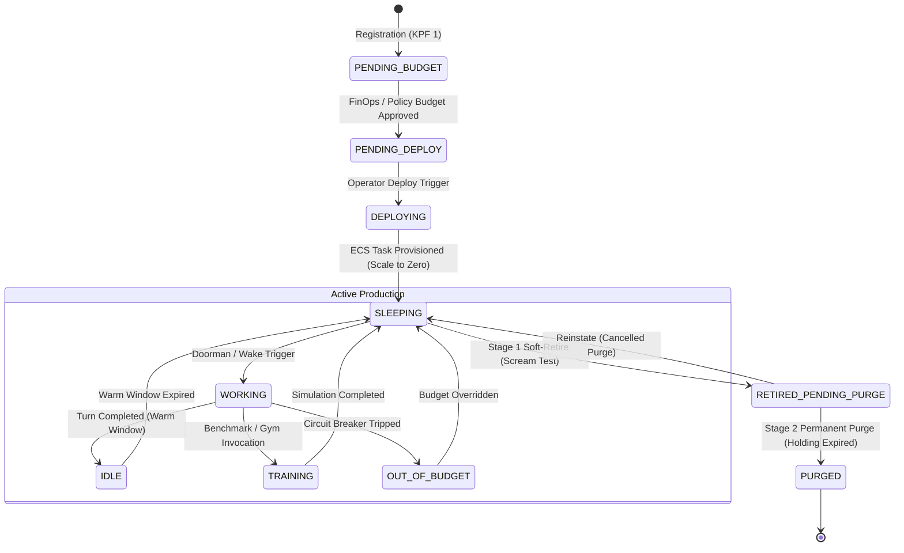

# Cartridge Builder Lab Guide — Agent Factory

Welcome to the **Agent Cartridge Builder Lab**. This guide is the canonical specification and hands-on laboratory for building, packaging, registering, and managing autonomous agent cartridges for the BeerCanLabs Agent Factory.

Whether you are building manually, instructing an AI assistant (Antigravity `agy` or Claude Code) to build for you, or using the in-app **Garrison Workshop**, this lab provides the exact blueprint.

---

## 1. Architectural Philosophy: The Cartridge Pattern

In the Agent Factory ecosystem:
* **The Cartridge is Independent:** An agent never lives inside the Factory repository. Each agent lives in its own standalone repository (e.g. `github.com/dalesackrider/SM-donna` or `github.com/dalesackrider/SM-finley`).
* **The Factory is the Host Platform:** The Factory handles RBAC, cryptographic ledgering (WORM), BYO secrets injection, egress metering/FinOps, Doorman presence, and automated cloud provisioning.
* **Scale-to-Zero:** Agents do not hold open 24/7 WebSockets or idle compute. Doorman maintains presence (Discord, Slack) and wakes the agent on demand.
* **Declarative Manifest:** The agent's identity, triggers, compute requirements, and secrets are declared in a root [`cartridge.yaml`](#2-the-cartridgeyaml-specification).

---

## 2. Cartridge Repository Anatomy

A compliant cartridge repository follows this structure:

```text
SM-myagent/
├── cartridge.yaml            # Canonical Factory manifest
├── Dockerfile                # Multi-stage container build
├── soul.md                   # Persona, behavioral rules, and mandate
├── agent.py (or index.ts)    # Runtime loop & HTTP wake handler
├── requirements.txt / pkg    # Language dependencies
├── skills/                   # Domain capabilities (APIs, tools, MCP)
│   └── custom_tool/
└── bench.yaml                # Deterministic evaluation rubric (The Gym)
```

---

## 3. The `cartridge.yaml` Specification

The root `cartridge.yaml` is the contract between your agent and the Factory:

```yaml
schema: 1.0
id: "sm-researcher"
name: "Deep Researcher"
role: "Autonomous Technical Research and Synthesis Specialist"

# 1. Compute & Packaging
compute:
  runtime: "python3.11"
  # During development, specify source build:
  dockerfile: "./Dockerfile"
  # Or point to a published prebuilt image:
  # ref: "566332862296.dkr.ecr.us-east-1.amazonaws.com/factory-agent-sm-researcher:latest"
  cpu: 512       # 0.5 vCPU
  memory: 1024   # 1.0 GB RAM

# 2. Keymaster Secrets Classification
secrets:
  # Ungated: Injected as environment variables at task boot (e.g. read-only APIs)
  ungated:
    - "RESEARCH_API_READ_KEY"
    - "SLACK_NOTIFY_WEBHOOK"
  # Gated: Held securely by Keymaster. Only unlocked when human approval is recorded in ledger
  gated:
    - "PRODUCTION_WRITE_TOKEN"
    - "STRIPE_SECRET_KEY"

# 3. Ingress Triggers
triggers:
  - type: "discord"
    channel: "research-ops"
  - type: "webhook"
    path: "/hooks/inbound-query"
  - type: "cron"
    schedule: "0 8 * * 1-5"  # Mon-Fri 8:00 AM UTC

# 4. Persistence & Memory
persistence:
  prefix: "researcher-mind" # S3 key / filesystem prefix for state storage

# 5. Runtime Lifecycle
runtime:
  warmDownSeconds: 300      # Stays warm for 5 minutes after last task before sleeping
```

---

## 4. The Agent Runtime Loop

Your container must listen on the port specified by the `$PORT` environment variable (default: `8080`) and implement a wake/trigger endpoint:

### Environment Variables Provided by Factory:
* `PORT`: HTTP port to bind (e.g. `8080`).
* `FACTORY_URL`: Factory Control Plane internal URL (`http://control-plane.factory.internal:8088`).
* `FACTORY_GATEWAY_URL`: Factory Egress Gateway (`http://gateway.factory.internal:8089`). All outbound LLM and MCP calls **must** route through this URL for token metering and secret injection.
* `AGENT_ID`: The unique identifier of this cartridge.
* `MEMORY_STORE_URI`: Path/bucket for long-term memory.

### Python Minimal Skeleton (`agent.py`):
```python
import os
from http.server import HTTPServer, BaseHTTPRequestHandler
import json

PORT = int(os.environ.get("PORT", 8080))
GATEWAY_URL = os.environ.get("FACTORY_GATEWAY_URL", "http://localhost:8089")

class AgentHandler(BaseHTTPRequestHandler):
    def do_POST(self):
        if self.path in ["/wake", "/"]:
            content_length = int(self.headers.get("Content-Length", 0))
            payload = json.loads(self.rfile.read(content_length)) if content_length > 0 else {}
            
            # Execute agent turn...
            response = {"status": "ok", "result": f"Processed prompt: {payload.get('input', '')}"}
            
            self.send_response(200)
            self.send_header("Content-Type", "application/json")
            self.end_headers()
            self.wfile.write(json.dumps(response).encode("utf-8"))
        else:
            self.send_response(404)
            self.end_headers()

if __name__ == "__main__":
    server = HTTPServer(("0.0.0.0", PORT), AgentHandler)
    print(f"Agent listening on port {PORT}...")
    server.serve_forever()
```

---

## 5. Registering Your Agent (KPF 1)

You can register your cartridge through two avenues:

### Method A: Headless API (Direct or via Claude/AGY)
You can instruct your AI assistant or run `curl` to register your repository:

```bash
curl -X POST https://agent-factory.beercanlabs.com/api/v1/registry/agents \
  -H "Authorization: Bearer $FACTORY_TOKEN" \
  -H "Content-Type: application/json" \
  -d '{
    "id": "sm-researcher",
    "name": "Deep Researcher",
    "role": "Autonomous Technical Research Specialist",
    "repo": "https://github.com/dalesackrider/SM-researcher",
    "secrets": ["RESEARCH_API_READ_KEY"]
  }'
```

**Expected Response (HTTP 201 Created):**
```json
{
  "id": "sm-researcher",
  "name": "Deep Researcher",
  "role": "Autonomous Technical Research Specialist",
  "state": "PENDING_BUDGET",
  "artifact": "https://github.com/dalesackrider/SM-researcher",
  "requires": ["RESEARCH_API_READ_KEY"]
}
```

### Method B: The Garrison Workshop Lab (In-App)
1. In the Garrison 3D interface, navigate to **The Workshop** hex tile.
2. Click **Open Builder Lab**.
3. Fill in the Workshop registration form (Git Repo URL, Cartridge ID, Role, Declared Secrets).
4. Click **Register Agent**. Garrison executes the registration call on your behalf and begins tracking the live onboarding ladder.

---

## 6. The Complete Lifecycle State Machine

Once registered, the cartridge moves through a strict, tamper-evident lifecycle:



### Lifecycle API Reference:

| Endpoint | Method | Role | Description |
| :--- | :---: | :---: | :--- |
| `/api/v1/registry/agents/:id` | `GET` | `viewer` | **Query State:** Returns current lifecycle state (`PENDING_BUDGET`, `SLEEPING`, etc.), spend, and timestamps. |
| `/api/v1/registry/agents/:id/budget` | `PUT` | `admin` | **Assign Budget:** Sets daily/monthly USD budget. Moves agent from `PENDING_BUDGET` → `PENDING_DEPLOY`. |
| `/api/v1/registry/agents/:id/deploy` | `POST` | `admin` | **Deploy:** Builds container and provisions cloud ECS task definition (`DEPLOYING` → `SLEEPING`). |
| `/api/v1/registry/agents/:id/retire` | `POST` | `admin` | **Soft-Retire (Scream Test):** Cuts compute and Doorman presence ($0 cost). Enters `RETIRED_PENDING_PURGE` for 7 days. |
| `/api/v1/registry/agents/:id/reinstate` | `POST` | `admin` | **Reinstate:** Aborts retirement and returns agent to `SLEEPING`. |
| `/api/v1/registry/agents/:id/purge` | `POST` | `admin` | **Permanent Purge:** Destroys task definitions, deletes secrets, archives memory. |

---

## 7. How Garrison Visualizes Your Agent's State

Garrison does not give agents their own permanent hex tiles. Instead, **your agent appears on the functional facility tile corresponding to its live lifecycle state**:

| Agent State | In-World Location | 3D Visual Indicator | Interactive Click View |
| :--- | :--- | :--- | :--- |
| **`PENDING_BUDGET` / `DEPLOYING`** | **The Workshop** | Holographic blueprint on assembly pad | Onboarding checklist & build logs |
| **`SLEEPING`** | **The Barracks** | `Zzz` floating animated particles above roof | Table view of sleeping fleet with `[Wake]` button |
| **`IDLE`** | **The Yard** | Avatar standing outside with bored icon | Quick-command / dispatch inspector |
| **`TRAINING`** | **The Gym** | Avatar in sparring / obstacle ring | Accuracy & cost benchmark scorecards |
| **`OUT_OF_BUDGET`** | **The Bank** | In line outside bank with broke icon (`💸❌`) | FinOps override & limit inspector |
| **`WORKING`** | **The Factory** | Active machinery & working animation | Live run duration, goal, and tool stream |
| **`RETIRED_PENDING_PURGE`** | **The Cemetery** | Tombstone with countdown banner (no avatar) | Purge countdown table with `[Reinstate]` button |
